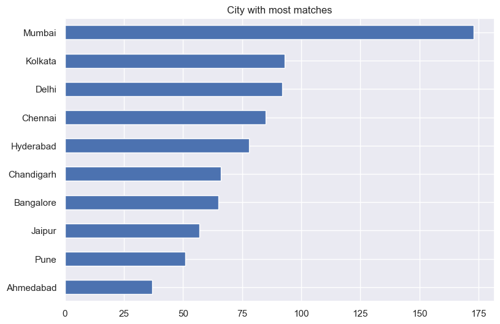
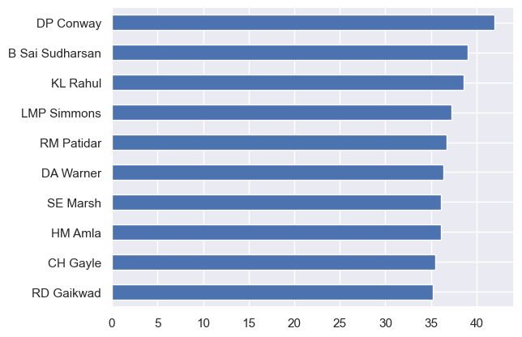

# EDA on the Indian Premier League (2008-2023)

## The Indian Premier League (IPL) is a men's Twenty20 (T20) cricket league that is annually held in India and contested by ten city-based franchise teams. The BCCI founded the league in 2007. The competition is usually held in summer between March and May every year. The IPL is the most-popular cricket league in the world

## This EDA is divided into 2 parts. We'll first look at team anlyisis and then move to individual player analysis. The source data is derived from Kaggle.


```python
# Initial imports
import pandas as pd
import numpy as np
import matplotlib.pyplot as plt
import seaborn as sns
sns.set()
%matplotlib inline
pd.set_option("display.max_columns", 100)
pd.set_option("display.max_rows", 1000)
```

## Adding 2023 matches to the master data.

### The original file from Kaggle did not have the match data for IPL 2023. New data was downloaded from a cricket data repository. Some data prep was needed before adding this data to the original file.


```python
#Selecting only the files for IPL 2023 as the downloaded data had all seasons data.

import os
import csv

folder_path = r"C:\Users\naveen.sequeira\Downloads\ipl_csv2"
start_number = 1359475
end_number = 1370353


files = []

for number in range(start_number, end_number + 1):
    file_name = str(number) + "_info.csv"
    file_path = os.path.join(folder_path, file_name)
    if os.path.isfile(file_path):
        files.append(file_path)
```


```python
#The combined files were then concatenated vertically. 
#But the combined files had an issue. They had team and umpire repeating twice.
#So I had to write some code to rename them as team1, team2, umpire1 and umpire2


lst = pd.DataFrame()


for file in files:
    print(file)
    match_id = file.split("\\")[-1].split("_")[0]
    df = pd.read_csv(file, skiprows=1, usecols=[1,2], header=None, names=["info_", "data"])\
         .query("info_ not in ['player', 'registry']")\
         .append({"info_": "matchId", "data": match_id}, ignore_index=True)
    
    duplicate_list = df.info_.duplicated(keep=False)
    
    team_duplicates_count = 1
    umpire_duplicates_count = 1

    for index, is_duplicate in enumerate(duplicate_list):
        if is_duplicate:
            if df.loc[index, "info_"] == "team":
                df.loc[index, "info_"] = f"team{team_duplicates_count}"
                team_duplicates_count += 1
            elif df.loc[index, "info_"] == "umpire":
                df.loc[index, "info_"] = f"umpire{umpire_duplicates_count}"
                umpire_duplicates_count += 1
    
    df = df.set_index("info_")
    
    lst = pd.concat([lst, df], axis=1)
```


```python
#Converting the dataframe from long format to wide format
lst = lst.T.reset_index(drop=True).rename_axis(None, axis=1)
```


```python
#Append 2023 data to the master data and save it
matches = matches.append(lst)
matches.to_csv("matches_updated_mens_ipl_2023.csv", index=False)
```

## The data for the EDA comes from two csv files. One file consists only match related information and another file contains ball by ball data. We'll explore team analysis using the match data


## Intial exploration and data cleaning


```python
matches = pd.read_csv("matches_updated_mens_ipl_2023.csv")
```


```python
matches.head()
```

<table border="1" class="dataframe">
  <thead>
    <tr style="text-align: right;">
      <th></th>
      <th>event</th>
      <th>date</th>
      <th>team1</th>
      <th>toss_winner</th>
      <th>umpire2</th>
      <th>match_referee</th>
      <th>season</th>
      <th>team2</th>
      <th>winner_runs</th>
      <th>balls_per_over</th>
      <th>player_of_match</th>
      <th>neutralvenue</th>
      <th>venue</th>
      <th>method</th>
      <th>toss_decision</th>
      <th>city</th>
      <th>winner</th>
      <th>umpire1</th>
      <th>match_number</th>
      <th>eliminator</th>
      <th>winner_wickets</th>
      <th>matchId</th>
      <th>gender</th>
      <th>reserve_umpire</th>
      <th>tv_umpire</th>
      <th>outcome</th>
    </tr>
  </thead>
  <tbody>
    <tr>
      <th>0</th>
      <td>Indian Premier League</td>
      <td>05-04-2017 00:00</td>
      <td>Sunrisers Hyderabad</td>
      <td>Royal Challengers Bangalore</td>
      <td>NJ Llong</td>
      <td>J Srinath</td>
      <td>2017</td>
      <td>Royal Challengers Bangalore</td>
      <td>35.0</td>
      <td>6</td>
      <td>Yuvraj Singh</td>
      <td>NaN</td>
      <td>Rajiv Gandhi International Stadium, Uppal</td>
      <td>NaN</td>
      <td>field</td>
      <td>Hyderabad</td>
      <td>Sunrisers Hyderabad</td>
      <td>AY Dandekar</td>
      <td>1.0</td>
      <td>NaN</td>
      <td>NaN</td>
      <td>1082591</td>
      <td>NaN</td>
      <td>NaN</td>
      <td>NaN</td>
      <td>NaN</td>
    </tr>
    <tr>
      <th>1</th>
      <td>Indian Premier League</td>
      <td>06-04-2017 00:00</td>
      <td>Rising Pune Supergiant</td>
      <td>Rising Pune Supergiant</td>
      <td>S Ravi</td>
      <td>M Nayyar</td>
      <td>2017</td>
      <td>Mumbai Indians</td>
      <td>NaN</td>
      <td>6</td>
      <td>SPD Smith</td>
      <td>NaN</td>
      <td>Maharashtra Cricket Association Stadium</td>
      <td>NaN</td>
      <td>field</td>
      <td>Pune</td>
      <td>Rising Pune Supergiant</td>
      <td>A Nand Kishore</td>
      <td>2.0</td>
      <td>NaN</td>
      <td>7.0</td>
      <td>1082592</td>
      <td>NaN</td>
      <td>NaN</td>
      <td>NaN</td>
      <td>NaN</td>
    </tr>
    <tr>
      <th>2</th>
      <td>Indian Premier League</td>
      <td>07-04-2017 00:00</td>
      <td>Gujarat Lions</td>
      <td>Kolkata Knight Riders</td>
      <td>CK Nandan</td>
      <td>V Narayan Kutty</td>
      <td>2017</td>
      <td>Kolkata Knight Riders</td>
      <td>NaN</td>
      <td>6</td>
      <td>CA Lynn</td>
      <td>NaN</td>
      <td>Saurashtra Cricket Association Stadium</td>
      <td>NaN</td>
      <td>field</td>
      <td>Rajkot</td>
      <td>Kolkata Knight Riders</td>
      <td>Nitin Menon</td>
      <td>3.0</td>
      <td>NaN</td>
      <td>10.0</td>
      <td>1082593</td>
      <td>NaN</td>
      <td>NaN</td>
      <td>NaN</td>
      <td>NaN</td>
    </tr>
    <tr>
      <th>3</th>
      <td>Indian Premier League</td>
      <td>08-04-2017 00:00</td>
      <td>Kings XI Punjab</td>
      <td>Kings XI Punjab</td>
      <td>C Shamshuddin</td>
      <td>Chinmay Sharma</td>
      <td>2017</td>
      <td>Rising Pune Supergiant</td>
      <td>NaN</td>
      <td>6</td>
      <td>GJ Maxwell</td>
      <td>NaN</td>
      <td>Holkar Cricket Stadium</td>
      <td>NaN</td>
      <td>field</td>
      <td>Indore</td>
      <td>Kings XI Punjab</td>
      <td>AK Chaudhary</td>
      <td>4.0</td>
      <td>NaN</td>
      <td>6.0</td>
      <td>1082594</td>
      <td>NaN</td>
      <td>NaN</td>
      <td>NaN</td>
      <td>NaN</td>
    </tr>
    <tr>
      <th>4</th>
      <td>Indian Premier League</td>
      <td>08-04-2017 00:00</td>
      <td>Royal Challengers Bangalore</td>
      <td>Royal Challengers Bangalore</td>
      <td>VK Sharma</td>
      <td>J Srinath</td>
      <td>2017</td>
      <td>Delhi Daredevils</td>
      <td>15.0</td>
      <td>6</td>
      <td>KM Jadhav</td>
      <td>NaN</td>
      <td>M.Chinnaswamy Stadium</td>
      <td>NaN</td>
      <td>bat</td>
      <td>Bengaluru</td>
      <td>Royal Challengers Bangalore</td>
      <td>S Ravi</td>
      <td>5.0</td>
      <td>NaN</td>
      <td>NaN</td>
      <td>1082595</td>
      <td>NaN</td>
      <td>NaN</td>
      <td>NaN</td>
      <td>NaN</td>
    </tr>
  </tbody>
</table>
</div>


```python
matches.info()
```

    <class 'pandas.core.frame.DataFrame'>
    RangeIndex: 1098 entries, 0 to 1097
    Data columns (total 26 columns):
     #   Column           Non-Null Count  Dtype  
    ---  ------           --------------  -----  
     0   event            1098 non-null   object 
     1   date             1098 non-null   object 
     2   team1            1098 non-null   object 
     3   toss_winner      1098 non-null   object 
     4   umpire2          1098 non-null   object 
     5   match_referee    1098 non-null   object 
     6   season           1098 non-null   int64  
     7   team2            1098 non-null   object 
     8   winner_runs      503 non-null    float64
     9   balls_per_over   1098 non-null   int64  
     10  player_of_match  1092 non-null   object 
     11  neutralvenue     77 non-null     object 
     12  venue            1098 non-null   object 
     13  method           20 non-null     object 
     14  toss_decision    1098 non-null   object 
     15  city             1047 non-null   object 
     16  winner           1078 non-null   object 
     17  umpire1          1098 non-null   object 
     18  match_number     1032 non-null   float64
     19  eliminator       14 non-null     object 
     20  winner_wickets   575 non-null    float64
     21  matchId          1098 non-null   int64  
     22  gender           74 non-null     object 
     23  reserve_umpire   74 non-null     object 
     24  tv_umpire        74 non-null     object 
     25  outcome          1 non-null      object 
    dtypes: float64(3), int64(3), object(20)
    memory usage: 223.2+ KB
    


```python
matches.describe()
```

<table border="1" class="dataframe">
  <thead>
    <tr style="text-align: right;">
      <th></th>
      <th>season</th>
      <th>winner_runs</th>
      <th>balls_per_over</th>
      <th>match_number</th>
      <th>winner_wickets</th>
      <th>matchId</th>
    </tr>
  </thead>
  <tbody>
    <tr>
      <th>count</th>
      <td>1098.000000</td>
      <td>503.000000</td>
      <td>1098.0</td>
      <td>1032.000000</td>
      <td>575.000000</td>
      <td>1.098000e+03</td>
    </tr>
    <tr>
      <th>mean</th>
      <td>2016.080146</td>
      <td>30.125249</td>
      <td>6.0</td>
      <td>31.535853</td>
      <td>6.180870</td>
      <td>9.018717e+05</td>
    </tr>
    <tr>
      <th>std</th>
      <td>4.855707</td>
      <td>26.853784</td>
      <td>0.0</td>
      <td>18.416685</td>
      <td>1.841824</td>
      <td>3.623810e+05</td>
    </tr>
    <tr>
      <th>min</th>
      <td>2008.000000</td>
      <td>1.000000</td>
      <td>6.0</td>
      <td>1.000000</td>
      <td>1.000000</td>
      <td>3.359820e+05</td>
    </tr>
    <tr>
      <th>25%</th>
      <td>2012.000000</td>
      <td>10.500000</td>
      <td>6.0</td>
      <td>16.000000</td>
      <td>5.000000</td>
      <td>5.483322e+05</td>
    </tr>
    <tr>
      <th>50%</th>
      <td>2016.000000</td>
      <td>22.000000</td>
      <td>6.0</td>
      <td>31.000000</td>
      <td>6.000000</td>
      <td>9.809640e+05</td>
    </tr>
    <tr>
      <th>75%</th>
      <td>2021.000000</td>
      <td>41.500000</td>
      <td>6.0</td>
      <td>46.000000</td>
      <td>7.000000</td>
      <td>1.254065e+06</td>
    </tr>
    <tr>
      <th>max</th>
      <td>2023.000000</td>
      <td>146.000000</td>
      <td>6.0</td>
      <td>72.000000</td>
      <td>10.000000</td>
      <td>1.370353e+06</td>
    </tr>
  </tbody>
</table>
</div>


```python
# Drop unwanted columns
unwanted_cols = ["outcome", "gender", "reserve_umpire","tv_umpire"]
matches = matches.drop(columns=unwanted_cols)
```


```python
#Change date columns to correct format
matches.date  = matches.date.astype("datetime64")
```


```python
np.sort(matches.season.unique())
```


    array([2008, 2009, 2010, 2011, 2012, 2013, 2014, 2015, 2016, 2017, 2018,
           2019, 2020, 2021, 2022, 2023], dtype=int64)


```python
#Correct different names for Rising Pune Supergiant
# First find all columns where the wrong name exists and then change it
value_exists = matches.isin(["Rising Pune Supergiants"]).any()
value_exists[value_exists].index.tolist()
matches[['team1', 'toss_winner', 'team2', 'winner']] = matches[['team1', 'toss_winner', 'team2', 'winner']].replace(
    "Rising Pune Supergiants", "Rising Pune Supergiant"
    )
```


```python
#Adjust for changed team names
name_changes = {
    "Delhi Daredevils": "Delhi Capitals",
    "Kings XI Punjab": "Punjab Kings"
}
matches[['team1', 'toss_winner', 'team2', 'winner']] = matches[['team1', 'toss_winner', 'team2', 'winner']].replace(
    name_changes
)
```


```python
# shorten team names for convenience
team_names = np.unique([matches.team1, matches.team2]).tolist()
short_names = ["".join([name[0] for name in name.split()]) for name in team_names]
shortened_names = dict(zip(team_names, short_names))
shortened_names["Deccan Chargers"] = "DCH"
shortened_names["Sunrisers Hyderabad"] = "SRH"
shortened_names
```


    {'Chennai Super Kings': 'CSK',
     'Deccan Chargers': 'DCH',
     'Delhi Capitals': 'DC',
     'Gujarat Lions': 'GL',
     'Gujarat Titans': 'GT',
     'Kochi Tuskers Kerala': 'KTK',
     'Kolkata Knight Riders': 'KKR',
     'Lucknow Super Giants': 'LSG',
     'Mumbai Indians': 'MI',
     'Pune Warriors': 'PW',
     'Punjab Kings': 'PK',
     'Rajasthan Royals': 'RR',
     'Rising Pune Supergiant': 'RPS',
     'Royal Challengers Bangalore': 'RCB',
     'Sunrisers Hyderabad': 'SRH'}


```python
matches[['team1', 'toss_winner', 'team2', 'winner']] = matches[['team1', 'toss_winner', 'team2', 'winner']].replace(
    shortened_names
)
```


```python
#defunct teams
defunct_teams = ["GL", "DCH", "KTK", "PW", "RPS"]
```

## Now that we have everything ready, let's dive into to all the IPL stats

### Who won the most matches?


```python
pd.DataFrame({
    "Matches":matches.groupby("team1").team1.count() + matches.groupby("team2").team2.count(),
    "Matches_Won": matches.groupby("winner").winner.count()
})\
.assign(Win_pct=lambda x: (x.Matches_Won / x.Matches).round(2))\
.drop(defunct_teams)\
.sort_values("Win_pct", ascending=False)
```

<div>
<table border="1" class="dataframe">
  <thead>
    <tr style="text-align: right;">
      <th></th>
      <th>Matches</th>
      <th>Matches_Won</th>
      <th>Win_pct</th>
    </tr>
  </thead>
  <tbody>
    <tr>
      <th>GT</th>
      <td>50</td>
      <td>34</td>
      <td>0.68</td>
    </tr>
    <tr>
      <th>CSK</th>
      <td>240</td>
      <td>141</td>
      <td>0.59</td>
    </tr>
    <tr>
      <th>LSG</th>
      <td>45</td>
      <td>25</td>
      <td>0.56</td>
    </tr>
    <tr>
      <th>MI</th>
      <td>263</td>
      <td>147</td>
      <td>0.56</td>
    </tr>
    <tr>
      <th>KKR</th>
      <td>251</td>
      <td>125</td>
      <td>0.50</td>
    </tr>
    <tr>
      <th>RR</th>
      <td>220</td>
      <td>108</td>
      <td>0.49</td>
    </tr>
    <tr>
      <th>RCB</th>
      <td>254</td>
      <td>121</td>
      <td>0.48</td>
    </tr>
    <tr>
      <th>SRH</th>
      <td>180</td>
      <td>82</td>
      <td>0.46</td>
    </tr>
    <tr>
      <th>PK</th>
      <td>246</td>
      <td>110</td>
      <td>0.45</td>
    </tr>
    <tr>
      <th>DC</th>
      <td>252</td>
      <td>110</td>
      <td>0.44</td>
    </tr>
  </tbody>
</table>
</div>


```python
(
matches.groupby("winner").winner.count() / 
(matches.groupby("team1").team1.count() + matches.groupby("team2").team2.count())
)\
.drop(defunct_teams)\
.sort_values(ascending=False).plot(kind="bar")
plt.title("Win Percentage")
plt.xticks(rotation=40)
plt.xlabel("")
plt.savefig("win_pct.svg");
```


    

    


### Toss Factor


```python
matches.toss_decision.value_counts()\
.plot(kind="pie", autopct='%1.1f%%')
plt.title("Teams winning toss choose:")
plt.axis("off")
plt.xlabel("");
```


    

    


```python
pd.Series(
          [matches[matches.toss_winner == matches.winner].winner.count(),
           matches[matches.toss_winner != matches.winner].winner.count()],
           index=["Won", "Lost"], name=""
).plot.pie(autopct='%1.1f%%',  startangle=50, colors=[ "#F7B7A3","#FFF1C9"])
plt.title("Toss Factor (After winning toss - Win%)");
```


    

    


```python
pd.Series(
    [matches.query("toss_decision=='field' and winner_wickets == winner_wickets").winner.count(),
     matches.query("toss_decision=='bat' and winner_runs == winner_runs").winner.count()],
     index=["Chasing", "Bat First"], name="")\
.plot.pie(autopct='%1.1f%%', colors=["#726FB8",  "#EA5F89"])
plt.title("Batting First vs Chasing (Win%)");
```


    

    


### Most Player Of the Match Awards


```python
matches.player_of_match.value_counts().nlargest(10).sort_values().plot.barh(figsize=(10,6))
a = matches.player_of_match.value_counts().nlargest(10).sort_values()
for i, value in enumerate(a):
    plt.text(value+0.08, i, str(round(value)), ha="left", va="center_baseline")
plt.xticks([])
plt.title("IPL - Most Man of the Match Awards")
plt.subplots_adjust(left=0.2);
```


    

    


### Some stats on the match officials


```python
matches.umpire1.value_counts().add(matches.umpire2.value_counts(), fill_value=0).nlargest(10).sort_values().plot.barh()
a = matches.umpire1.value_counts().add(matches.umpire2.value_counts(), fill_value=0).nlargest(10).sort_values()
plt.title("Most matches as Umpire")
plt.xticks([])
for i, value in enumerate(a):
    plt.text(value+0.08, i, str(round(value)), ha="left", va="center_baseline");
```


    

    


```python
matches.match_referee.value_counts().nlargest(10).sort_values().plot.barh()
plt.title("Most matches as Referee");
```


    

    


### City with Most Matches


```python
matches.city.value_counts().nlargest(10).sort_values().plot.barh(figsize=(10,6))
plt.title("City with most matches")
plt.subplots_adjust(left=0.2)
plt.savefig("city_mostMatches.svg");
```


    

    


### Points Table - All Seasons


```python
points_table = pd.read_html("https://www.cricketwa.com/pointstable/indian-premier-league.aspx")[1]
```


```python
points_table = points_table.drop(["Rank", "AVG"], axis=1).replace("-", np.nan)
```


```python
points_table.iloc[:, 1:] = points_table.iloc[:, 1:].astype(float)
```


```python
points_table.to_excel("ipl_allSeasons_pointsTable.xlsx", index=False)
```


```python
# A Seaborn Heatmap was used create the ranking table

import pandas as pd
import seaborn as sns
import matplotlib.pyplot as plt

# Create the heatmap
plt.figure(figsize=(10, 6))  # Adjust the figure size as needed
sns.heatmap(points_table.set_index("Team").sort_index(axis=1),
            annot=True, cmap='coolwarm', cbar=False,)

# Customize the chart
plt.ylabel(None)
plt.title('IPL Table Rankings (2008-2023)')
plt.subplots_adjust(left=0.22)
plt.savefig("team_rank.png")
```


    

    


## Player Analysis


```python
players = pd.read_csv("IPL_ball_by_ball_updated.csv", parse_dates=["start_date"])
```


```python
players
```

<div>
<table border="1" class="dataframe">
  <thead>
    <tr style="text-align: right;">
      <th></th>
      <th>match_id</th>
      <th>season</th>
      <th>start_date</th>
      <th>venue</th>
      <th>innings</th>
      <th>ball</th>
      <th>batting_team</th>
      <th>bowling_team</th>
      <th>striker</th>
      <th>non_striker</th>
      <th>bowler</th>
      <th>runs_off_bat</th>
      <th>extras</th>
      <th>wides</th>
      <th>noballs</th>
      <th>byes</th>
      <th>legbyes</th>
      <th>penalty</th>
      <th>wicket_type</th>
      <th>player_dismissed</th>
      <th>other_wicket_type</th>
      <th>other_player_dismissed</th>
    </tr>
  </thead>
  <tbody>
    <tr>
      <th>0</th>
      <td>335982</td>
      <td>2008</td>
      <td>2008-04-18</td>
      <td>M Chinnaswamy Stadium</td>
      <td>1</td>
      <td>0.1</td>
      <td>Kolkata Knight Riders</td>
      <td>Royal Challengers Bangalore</td>
      <td>SC Ganguly</td>
      <td>BB McCullum</td>
      <td>P Kumar</td>
      <td>0</td>
      <td>1</td>
      <td>NaN</td>
      <td>NaN</td>
      <td>NaN</td>
      <td>1.0</td>
      <td>NaN</td>
      <td>NaN</td>
      <td>NaN</td>
      <td>NaN</td>
      <td>NaN</td>
    </tr>
    <tr>
      <th>1</th>
      <td>335982</td>
      <td>2008</td>
      <td>2008-04-18</td>
      <td>M Chinnaswamy Stadium</td>
      <td>1</td>
      <td>0.2</td>
      <td>Kolkata Knight Riders</td>
      <td>Royal Challengers Bangalore</td>
      <td>BB McCullum</td>
      <td>SC Ganguly</td>
      <td>P Kumar</td>
      <td>0</td>
      <td>0</td>
      <td>NaN</td>
      <td>NaN</td>
      <td>NaN</td>
      <td>NaN</td>
      <td>NaN</td>
      <td>NaN</td>
      <td>NaN</td>
      <td>NaN</td>
      <td>NaN</td>
    </tr>
    <tr>
      <th>2</th>
      <td>335982</td>
      <td>2008</td>
      <td>2008-04-18</td>
      <td>M Chinnaswamy Stadium</td>
      <td>1</td>
      <td>0.3</td>
      <td>Kolkata Knight Riders</td>
      <td>Royal Challengers Bangalore</td>
      <td>BB McCullum</td>
      <td>SC Ganguly</td>
      <td>P Kumar</td>
      <td>0</td>
      <td>1</td>
      <td>1.0</td>
      <td>NaN</td>
      <td>NaN</td>
      <td>NaN</td>
      <td>NaN</td>
      <td>NaN</td>
      <td>NaN</td>
      <td>NaN</td>
      <td>NaN</td>
    </tr>
    <tr>
      <th>3</th>
      <td>335982</td>
      <td>2008</td>
      <td>2008-04-18</td>
      <td>M Chinnaswamy Stadium</td>
      <td>1</td>
      <td>0.4</td>
      <td>Kolkata Knight Riders</td>
      <td>Royal Challengers Bangalore</td>
      <td>BB McCullum</td>
      <td>SC Ganguly</td>
      <td>P Kumar</td>
      <td>0</td>
      <td>0</td>
      <td>NaN</td>
      <td>NaN</td>
      <td>NaN</td>
      <td>NaN</td>
      <td>NaN</td>
      <td>NaN</td>
      <td>NaN</td>
      <td>NaN</td>
      <td>NaN</td>
    </tr>
    <tr>
      <th>4</th>
      <td>335982</td>
      <td>2008</td>
      <td>2008-04-18</td>
      <td>M Chinnaswamy Stadium</td>
      <td>1</td>
      <td>0.5</td>
      <td>Kolkata Knight Riders</td>
      <td>Royal Challengers Bangalore</td>
      <td>BB McCullum</td>
      <td>SC Ganguly</td>
      <td>P Kumar</td>
      <td>0</td>
      <td>0</td>
      <td>NaN</td>
      <td>NaN</td>
      <td>NaN</td>
      <td>NaN</td>
      <td>NaN</td>
      <td>NaN</td>
      <td>NaN</td>
      <td>NaN</td>
      <td>NaN</td>
    </tr>
    <tr>
      <th>...</th>
      <td>...</td>
      <td>...</td>
      <td>...</td>
      <td>...</td>
      <td>...</td>
      <td>...</td>
      <td>...</td>
      <td>...</td>
      <td>...</td>
      <td>...</td>
      <td>...</td>
      <td>...</td>
      <td>...</td>
      <td>...</td>
      <td>...</td>
      <td>...</td>
      <td>...</td>
      <td>...</td>
      <td>...</td>
      <td>...</td>
      <td>...</td>
      <td>...</td>
    </tr>
    <tr>
      <th>243810</th>
      <td>1370353</td>
      <td>2023</td>
      <td>2023-05-29</td>
      <td>Narendra Modi Stadium, Ahmedabad</td>
      <td>2</td>
      <td>14.2</td>
      <td>Chennai Super Kings</td>
      <td>Gujarat Titans</td>
      <td>S Dube</td>
      <td>RA Jadeja</td>
      <td>MM Sharma</td>
      <td>1</td>
      <td>0</td>
      <td>NaN</td>
      <td>NaN</td>
      <td>NaN</td>
      <td>NaN</td>
      <td>NaN</td>
      <td>NaN</td>
      <td>NaN</td>
      <td>NaN</td>
      <td>NaN</td>
    </tr>
    <tr>
      <th>243811</th>
      <td>1370353</td>
      <td>2023</td>
      <td>2023-05-29</td>
      <td>Narendra Modi Stadium, Ahmedabad</td>
      <td>2</td>
      <td>14.3</td>
      <td>Chennai Super Kings</td>
      <td>Gujarat Titans</td>
      <td>RA Jadeja</td>
      <td>S Dube</td>
      <td>MM Sharma</td>
      <td>1</td>
      <td>0</td>
      <td>NaN</td>
      <td>NaN</td>
      <td>NaN</td>
      <td>NaN</td>
      <td>NaN</td>
      <td>NaN</td>
      <td>NaN</td>
      <td>NaN</td>
      <td>NaN</td>
    </tr>
    <tr>
      <th>243812</th>
      <td>1370353</td>
      <td>2023</td>
      <td>2023-05-29</td>
      <td>Narendra Modi Stadium, Ahmedabad</td>
      <td>2</td>
      <td>14.4</td>
      <td>Chennai Super Kings</td>
      <td>Gujarat Titans</td>
      <td>S Dube</td>
      <td>RA Jadeja</td>
      <td>MM Sharma</td>
      <td>1</td>
      <td>0</td>
      <td>NaN</td>
      <td>NaN</td>
      <td>NaN</td>
      <td>NaN</td>
      <td>NaN</td>
      <td>NaN</td>
      <td>NaN</td>
      <td>NaN</td>
      <td>NaN</td>
    </tr>
    <tr>
      <th>243813</th>
      <td>1370353</td>
      <td>2023</td>
      <td>2023-05-29</td>
      <td>Narendra Modi Stadium, Ahmedabad</td>
      <td>2</td>
      <td>14.5</td>
      <td>Chennai Super Kings</td>
      <td>Gujarat Titans</td>
      <td>RA Jadeja</td>
      <td>S Dube</td>
      <td>MM Sharma</td>
      <td>6</td>
      <td>0</td>
      <td>NaN</td>
      <td>NaN</td>
      <td>NaN</td>
      <td>NaN</td>
      <td>NaN</td>
      <td>NaN</td>
      <td>NaN</td>
      <td>NaN</td>
      <td>NaN</td>
    </tr>
    <tr>
      <th>243814</th>
      <td>1370353</td>
      <td>2023</td>
      <td>2023-05-29</td>
      <td>Narendra Modi Stadium, Ahmedabad</td>
      <td>2</td>
      <td>14.6</td>
      <td>Chennai Super Kings</td>
      <td>Gujarat Titans</td>
      <td>RA Jadeja</td>
      <td>S Dube</td>
      <td>MM Sharma</td>
      <td>4</td>
      <td>0</td>
      <td>NaN</td>
      <td>NaN</td>
      <td>NaN</td>
      <td>NaN</td>
      <td>NaN</td>
      <td>NaN</td>
      <td>NaN</td>
      <td>NaN</td>
      <td>NaN</td>
    </tr>
  </tbody>
</table>
<p>243815 rows × 22 columns</p>
</div>


```python
players.info()
```

    <class 'pandas.core.frame.DataFrame'>
    RangeIndex: 243815 entries, 0 to 243814
    Data columns (total 22 columns):
     #   Column                  Non-Null Count   Dtype         
    ---  ------                  --------------   -----         
     0   match_id                243815 non-null  int64         
     1   season                  243815 non-null  int64         
     2   start_date              243815 non-null  datetime64[ns]
     3   venue                   243815 non-null  object        
     4   innings                 243815 non-null  int64         
     5   ball                    243815 non-null  float64       
     6   batting_team            243815 non-null  object        
     7   bowling_team            243815 non-null  object        
     8   striker                 243815 non-null  object        
     9   non_striker             243815 non-null  object        
     10  bowler                  243815 non-null  object        
     11  runs_off_bat            243815 non-null  int64         
     12  extras                  243815 non-null  int64         
     13  wides                   7652 non-null    float64       
     14  noballs                 1018 non-null    float64       
     15  byes                    628 non-null     float64       
     16  legbyes                 3778 non-null    float64       
     17  penalty                 2 non-null       float64       
     18  wicket_type             12067 non-null   object        
     19  player_dismissed        12067 non-null   object        
     20  other_wicket_type       0 non-null       float64       
     21  other_player_dismissed  0 non-null       float64       
    dtypes: datetime64[ns](1), float64(8), int64(5), object(8)
    memory usage: 40.9+ MB
    


```python
# Remove unnecessary columns
players = players.drop(["other_wicket_type", "other_player_dismissed"], axis=1)
```


```python
players.describe()
```

<div>
<table border="1" class="dataframe">
  <thead>
    <tr style="text-align: right;">
      <th></th>
      <th>match_id</th>
      <th>season</th>
      <th>innings</th>
      <th>ball</th>
      <th>runs_off_bat</th>
      <th>extras</th>
      <th>wides</th>
      <th>noballs</th>
      <th>byes</th>
      <th>legbyes</th>
      <th>penalty</th>
    </tr>
  </thead>
  <tbody>
    <tr>
      <th>count</th>
      <td>2.438150e+05</td>
      <td>243815.000000</td>
      <td>243815.000000</td>
      <td>243815.000000</td>
      <td>243815.000000</td>
      <td>243815.000000</td>
      <td>7652.000000</td>
      <td>1018.000000</td>
      <td>628.000000</td>
      <td>3778.000000</td>
      <td>2.0</td>
    </tr>
    <tr>
      <th>mean</th>
      <td>8.707326e+05</td>
      <td>2015.611119</td>
      <td>1.483781</td>
      <td>9.557662</td>
      <td>1.252614</td>
      <td>0.067174</td>
      <td>1.204260</td>
      <td>1.034381</td>
      <td>1.867834</td>
      <td>1.304129</td>
      <td>5.0</td>
    </tr>
    <tr>
      <th>std</th>
      <td>3.532362e+05</td>
      <td>4.650281</td>
      <td>0.502855</td>
      <td>5.686347</td>
      <td>1.626764</td>
      <td>0.341990</td>
      <td>0.788406</td>
      <td>0.325568</td>
      <td>1.312454</td>
      <td>0.847922</td>
      <td>0.0</td>
    </tr>
    <tr>
      <th>min</th>
      <td>3.359820e+05</td>
      <td>2008.000000</td>
      <td>1.000000</td>
      <td>0.100000</td>
      <td>0.000000</td>
      <td>0.000000</td>
      <td>1.000000</td>
      <td>1.000000</td>
      <td>1.000000</td>
      <td>1.000000</td>
      <td>5.0</td>
    </tr>
    <tr>
      <th>25%</th>
      <td>5.483160e+05</td>
      <td>2012.000000</td>
      <td>1.000000</td>
      <td>4.500000</td>
      <td>0.000000</td>
      <td>0.000000</td>
      <td>1.000000</td>
      <td>1.000000</td>
      <td>1.000000</td>
      <td>1.000000</td>
      <td>5.0</td>
    </tr>
    <tr>
      <th>50%</th>
      <td>8.298190e+05</td>
      <td>2015.000000</td>
      <td>1.000000</td>
      <td>9.400000</td>
      <td>1.000000</td>
      <td>0.000000</td>
      <td>1.000000</td>
      <td>1.000000</td>
      <td>1.000000</td>
      <td>1.000000</td>
      <td>5.0</td>
    </tr>
    <tr>
      <th>75%</th>
      <td>1.216507e+06</td>
      <td>2020.000000</td>
      <td>2.000000</td>
      <td>14.400000</td>
      <td>1.000000</td>
      <td>0.000000</td>
      <td>1.000000</td>
      <td>1.000000</td>
      <td>4.000000</td>
      <td>1.000000</td>
      <td>5.0</td>
    </tr>
    <tr>
      <th>max</th>
      <td>1.370353e+06</td>
      <td>2023.000000</td>
      <td>6.000000</td>
      <td>19.900000</td>
      <td>6.000000</td>
      <td>7.000000</td>
      <td>5.000000</td>
      <td>5.000000</td>
      <td>4.000000</td>
      <td>5.000000</td>
      <td>5.0</td>
    </tr>
  </tbody>
</table>
</div>


## Batting stats

### Most Runs


```python
players.groupby("striker").runs_off_bat.sum().nlargest(10).sort_values()\
.plot.barh()
plt.ylabel(None);
```


    

    


### Most Centuries


```python
players.groupby(["match_id","striker"], as_index=False).runs_off_bat.sum()\
.query("runs_off_bat >= 100")\
.groupby("striker").striker.count().nlargest(10).sort_values()\
.plot.barh()
plt.ylabel(None);
```


    

    


### To omit outliers we'll use a qualification of min 200 balls faced for most of our remaining stats. We'll use this qualification to filter our results.


```python
above_200_balls = players.groupby("striker").ball.count()\
[lambda x: x>=200].index.to_list()
qualifiers = lambda x: x.index.isin(above_200_balls)
```

### Highest Averages


```python
players.groupby("striker").runs_off_bat.sum()\
[qualifiers]\
.div(players.groupby("striker").match_id.nunique()
     [qualifiers])\
.nlargest(10).sort_values()\
.plot.barh()
plt.ylabel(None);
```


    

    


### Highest Stike Rate


```python
# We have to exclude the wides and noballs to get the exact strike rate
players.groupby("striker").runs_off_bat.sum()\
[qualifiers]\
.div(players.query("wides != wides and noballs != noballs")
     .groupby("striker").ball.count()
     [qualifiers]).mul(100)\
.nlargest(10).sort_values()\
.plot.barh()
plt.ylabel(None);
```


    

    


### Best in the Business - Batters with a good average and high strike rate 


```python
avg = players.groupby("striker").runs_off_bat.sum()\
[qualifiers]\
.div(players.groupby("striker").match_id.nunique()
     [qualifiers])
sr = players.groupby("striker").runs_off_bat.sum()\
[qualifiers]\
.div(players.query("wides != wides and noballs != noballs")
     .groupby("striker").ball.count()
     [qualifiers]).mul(100)

avg_sr = pd.DataFrame({"Average": avg, "StrikeRate": sr}).query("Average >= 20 and StrikeRate >= 145")

plt.figure(figsize=(9,5))
ax = sns.scatterplot(x="Average", y="StrikeRate", data=avg_sr)

for i, row in avg_sr.iterrows():
    ax.text(row["Average"]+0.1, row["StrikeRate"]+0.1, i);
```


    

    


### Most sixes


```python
players.query("runs_off_bat == 6")\
.groupby("striker").runs_off_bat.count()\
.nlargest(10).sort_values()\
.plot.barh()
plt.ylabel(None);
```


    

    


### Sixes Per Innings


```python
players.query("runs_off_bat == 6")\
.groupby("striker").runs_off_bat.count()\
[qualifiers]\
.div(players.groupby("striker").match_id.nunique()
     [qualifiers])\
.nlargest(10).sort_values()\
.plot.barh()
plt.ylabel(None);
```


    

    


### Most Sixes in an Innings


```python
players.query("runs_off_bat == 6")\
.groupby(["match_id", "striker"], as_index=False).runs_off_bat.count()\
.iloc[:, 1:].nlargest(10, "runs_off_bat")\
.set_index("striker").sort_values("runs_off_bat")\
.plot.barh(legend=False)
plt.ylabel(None);
```


    

    


### An interesting stat - Least deliveries per six


```python
players.query("wides != wides and noballs != noballs")\
.groupby("striker").ball.count()\
[qualifiers]\
.div(players.query("runs_off_bat == 6")\
     .groupby("striker").runs_off_bat.count()
     [qualifiers])\
.nsmallest(10).sort_values(ascending=False)\
.plot.barh(legend=False, figsize=(8,6))
plt.subplots_adjust(left=0.2)
plt.ylabel(None);
# plt.title("Least per six across all IPL Seasons\n"
# "Lower the better (Qualification: Balls faced ≥200)");
```


    

    


#### It takes Andre Russell less than 7 balls to hit his first 6.

### Most fours


```python
players.query("runs_off_bat == 4")\
.groupby("striker").runs_off_bat.count()\
.nlargest(10).sort_values()\
.plot.barh()
plt.ylabel(None);
```


    

    


### Most Boundaries (4s and 6s)


```python
players.query("runs_off_bat in [6,4]")\
.groupby(["striker", "runs_off_bat"]).ball.count().unstack()\
.assign(Total= lambda x: x[4] + x[6]).nlargest(10, "Total").sort_values("Total").drop(columns="Total")\
.plot(kind="barh", stacked=True)
plt.ylabel(None)
plt.legend();
```


    

    


### Highest Boundary Percentage


```python
(
players.query("runs_off_bat in [6,4]")
.groupby("striker").runs_off_bat.sum()
[qualifiers]
.div(players.groupby("striker").runs_off_bat.sum()
     [qualifiers])
.nlargest(10).sort_values()
.plot.barh()
)
plt.ylabel(None);
```


    

    


#### Sunil Narine scores 80% of his runs in boundaries
